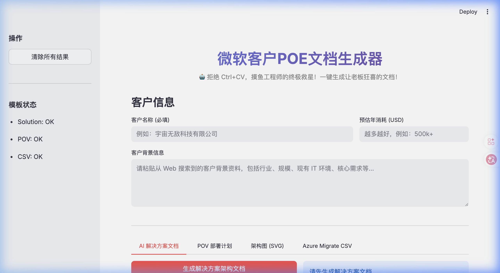
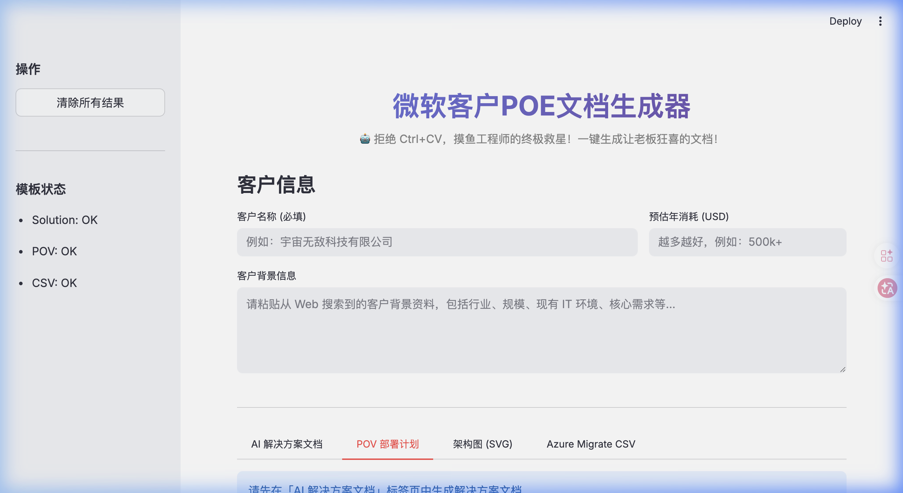
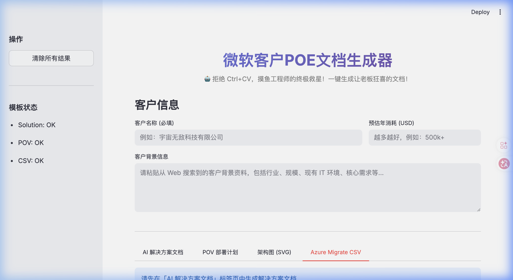

# 微软客户 POE 文档生成器

> 一键生成让老板狂喜的售前文档 —— AI 解决方案架构文档、POV 部署计划、SVG 架构图、Azure Migrate CSV，全部搞定。

---

## 目录

- [简介](#简介)
- [快速开始](#快速开始)
- [配置 Azure OpenAI 密钥](#配置-azure-openai-密钥)
- [功能模块详解](#功能模块详解)
  - [① AI 解决方案文档](#-ai-解决方案文档)
  - [② POV 部署计划](#-pov-部署计划)
  - [③ 架构图 SVG](#-架构图-svg)
  - [④ Azure Migrate CSV](#-azure-migrate-csv)
- [模板文件说明](#模板文件说明)
- [常见问题](#常见问题)
- [依赖说明](#依赖说明)

---

## 简介

**POE 文档生成器** 是一个基于 [Streamlit](https://streamlit.io/) 的 Web 应用，面向微软售前团队设计。它通过 **Azure OpenAI** 驱动文档内容生成，输出专业的 Word 文档（`.docx`）、SVG 矢量架构图以及 Azure Migrate 导入 CSV。

**核心优势：**
- 输入客户名称 + 背景信息，几十秒内输出完整的售前文档
- 文档风格与格式受 Word 模板约束，保持公司品牌一致性
- 生成结果实时预览，支持一键下载



---

## 快速开始

### 1. 安装依赖

```bash
pip install -r requirements.txt
```

### 2. 配置密钥（见下一节）

### 3. 启动应用

```bash
streamlit run app.py
```

浏览器会自动打开 `http://localhost:8501`。

---

## 配置 Azure OpenAI 密钥

在项目根目录的 `.streamlit/secrets.toml` 文件中填写以下内容：

```toml
AZURE_OPENAI_KEY      = "your-api-key"
AZURE_OPENAI_ENDPOINT = "https://your-resource.openai.azure.com/"
AZURE_OPENAI_DEPLOYMENT = "your-deployment-name"
AZURE_OPENAI_API_VERSION = "2024-06-01"   # 可选，默认即此版本
```

> **注意：** `.streamlit/secrets.toml` 已被 `.gitignore` 保护，请勿将密钥提交到代码库。

---

## 功能模块详解

应用分为 **4 个标签页**，推荐按顺序使用（①→②→③→④）。

### 公共输入区域

在页面顶部，首先填写：

| 字段 | 是否必填 | 说明 |
|---|---|---|
| **客户名称** | ✅ 必填 | 将出现在文档标题和文件名中 |
| **预估年消耗 (USD)** | 可选 | AI 会根据预算选择合适的模型和 SKU |
| **客户背景信息** | ✅ 必填（生成解决方案时）| 粘贴客户官网介绍、行业信息、痛点等 |

---

### ① AI 解决方案文档


**生成内容：** 完整的 Azure AI 售前解决方案架构文档（Word 格式）

**操作步骤：**
1. 填写顶部的客户名称、预算和背景信息
2. 点击「**生成解决方案架构文档**」按钮
3. 等待 AI 生成（通常约 30-60 秒）
4. 右侧预览区实时展示 Markdown 内容
5. 点击「**下载解决方案架构文档 (.docx)**」保存文件

**文档结构：**
- 封面标题（独占一页）
- 目录（可在 Word 中右键更新）
- 一、摘要 → 二、解决方案架构概览 → 三、业务背景 → 四、需求摘要 → 五、详细解决方案设计 → 六、安全架构 → 七、集成架构 → 八、资源架构

> **提示：** 生成完成后结果会被缓存，切换到其他标签页不会丢失。若需重新生成，点击「**重新生成**」。

---

### ② POV 部署计划



**前提条件：** 必须先完成「AI 解决方案文档」的生成。

**生成内容：** 与解决方案强关联的 POV 分阶段部署计划（Word 格式）

**操作步骤：**
1. 切换到「**POV 部署计划**」标签页
2. 选择 **POV 开始日期** 和 **结束日期**（默认 14 天）
3. 填写「**乙方项目人员**」（我方团队名单）
   - 格式示例：`技术负责人: 张三`（每行一人）
   - AI 会自动根据客户背景生成 2-3 名甲方人员
4. 点击「**生成 POV 部署计划**」
5. 下载 `.docx` 文件

**文档结构：**
- 一、执行周期（自动跳过周末，只计工作日）
- 二、项目目标（3 个可衡量指标）
- 三、核心团队成员与职责
- 四、分阶段详细部署计划（含每日任务表格和里程碑）

---

### ③ 架构图 SVG


**前提条件：** 必须先完成「AI 解决方案文档」的生成。

**生成内容：** 企业级 Azure 解决方案逻辑架构图（SVG 矢量图）

**操作步骤：**
1. 切换到「**架构图 (SVG)**」标签页
2. 点击「**生成 SVG 架构图**」
3. 图表实时渲染在页面中预览
4. 可选操作：
   - 点击「**下载 SVG 架构图**」保存为 `.svg` 文件
   - 展开「查看 SVG 代码」→ 点击「**复制 SVG 代码**」粘贴到 PPT 或其他工具

> **提示：** SVG 格式可无损缩放，建议嵌入 PowerPoint 或直接打印。

---

### ④ Azure Migrate CSV



**前提条件：** 必须先完成「AI 解决方案文档」的生成。

**生成内容：** 符合 Azure Migrate 导入格式的 CSV 文件，用于评估迁移成本

**操作步骤：**
1. 切换到「**Azure Migrate CSV**」标签页
2. 点击「**上传价格估算表 (.xlsx)**」，上传包含 Azure 资源估算的 Excel 文件
3. 点击「**生成 Azure Migrate CSV**」
4. 右侧表格预览生成结果
5. 点击「**下载 Azure Migrate CSV**」

> **说明：** AI 会根据价格估算表中的资源规格，反推客户本地环境的 VM 配置，生成 Azure Migrate 兼容格式的清单。

---

## 模板文件说明

模板文件存放在 `templates/` 目录下：

| 文件 | 用途 |
|---|---|
| `solution_template.docx.docx` | 解决方案架构文档的 Word 样式模板 |
| `pov_template.docx.docx` | POV 部署计划的 Word 样式模板 |
| `AzureMigrateimporttemplate.csv` | Azure Migrate 导入 CSV 表头模板 |

应用侧边栏的「**模板状态**」区域会显示各模板文件是否就位（`OK` / `Missing`）。

> **注意：** 若模板文件缺失，应用仍可运行，但生成的文档将使用空白样式，缺少公司品牌格式。

---

## 常见问题

**Q: 点击生成后长时间无响应？**  
A: Azure OpenAI 单次调用上限为 128,000 tokens，生成完整文档通常需要 30-90 秒，请耐心等待 Spinner 消失。

**Q: 出现「Azure OpenAI 配置缺失」错误？**  
A: 请检查 `.streamlit/secrets.toml` 文件是否存在且格式正确，确保 `AZURE_OPENAI_KEY`、`AZURE_OPENAI_ENDPOINT`、`AZURE_OPENAI_DEPLOYMENT` 三个字段均已填写。

**Q: Word 文档中的目录显示为空？**  
A: 这是正常现象。用 Word 打开文档后，按 `Ctrl+A` 全选，再按 `F9` 更新域，目录即可自动生成。

**Q: SVG 架构图中组件有重叠？**  
A: 点击「**重新生成架构图**」，AI 每次生成结果略有差异，通常第二次即可修正。

**Q: 如何清除所有已生成的内容，重新开始？**  
A: 点击左侧侧边栏的「**清除所有结果**」按钮。

**Q: 下载的文件名格式是什么？**  
A: 文件名格式为 `MMDD-客户名称-文档类型.扩展名`，例如：`0226-宇宙无敌科技-AI解决方案架构文档.docx`。

---

## 依赖说明

| 包 | 版本要求 | 用途 |
|---|---|---|
| `streamlit` | ≥ 1.30.0 | Web 应用框架 |
| `openai` | ≥ 1.10.0 | Azure OpenAI API 调用 |
| `python-docx` | ≥ 1.1.0 | Word 文档生成 |
| `openpyxl` | ≥ 3.1.0 | 读取 Excel 价格估算表 |
| `pandas` | ≥ 2.0.0 | CSV 预览表格渲染 |
